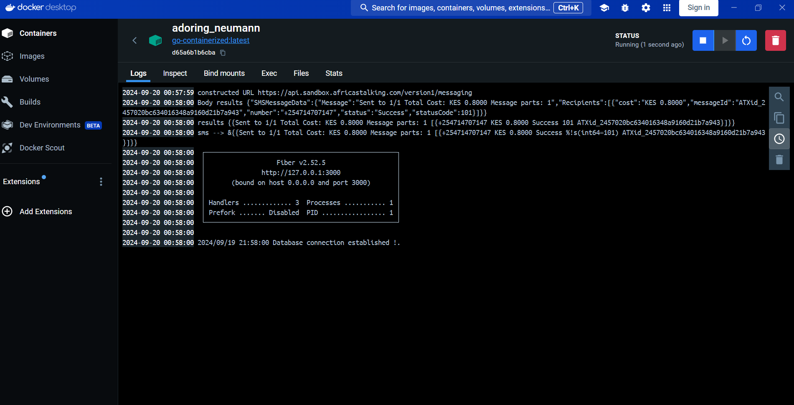
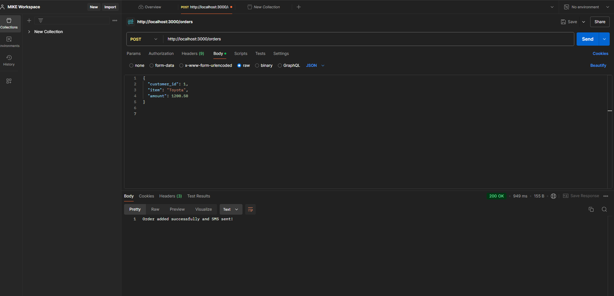

# Savannah_screening_test Technical-Interview

## Features

- Manage customers and orders with a simple API
- Authenticate via OpenID Connect
- Send SMS alerts using Africa's Talking
- Database: Uses PostgreSQL for data storage.

## Getting Started

1. Clone the repo: ``
2. Install dependencies: `go mod tidy`
3. Run the app: `go run main.go`


## Prerequisites
- Golang
- Docker
- Docker Hub account
- PostgreSQL database
- Postman for APIs Testing 
- Africa's Talking API credentials for SMS notifications


7. ### Set Up Keycloak
Used KeyCloak's documentation to get started. https://www.keycloak.org/getting-started/getting-started-docker


Docker Implementation


8. ### Configure MySQL
Set up a MySQL database

Created Customers Table


Created Orders Table


Overall Database Schema


9. Configured SMS Notifications
Set up Africa's Talking API credentials and configured my application to use these credentials for sending SMS notifications.

SMS Sent to customer after order creation


10. Configured CI/CD Pipeline with Ansible
I Set up ssh keys on my machine and the server for easier and secure communications.

I tested if I can reach my server after defining my hosts "linux" group,
```sh
ansible linux -m ping
```


## User Journey
Login Page


Redirected to login with KeyCloak


Simple Homepage


Add Customer Page


Success Adding a Customer


Add Order Page


Success Adding a Page


SMS Sent to customer after order creation


## Conclusion
My Customer-Order App is set up with Docker, Microk8s, MySQL, Keycloak, and SMS integration. Continuous deployment is managed via Ansible, ensuring my app stays up-to-date with minimal manual intervention.

{
  "name": "Bob Williams",
  "code": "CUST005"
}

{
  "customer_id": 1,
  "item": "Laptop",
  "amount": 1200.50
}
