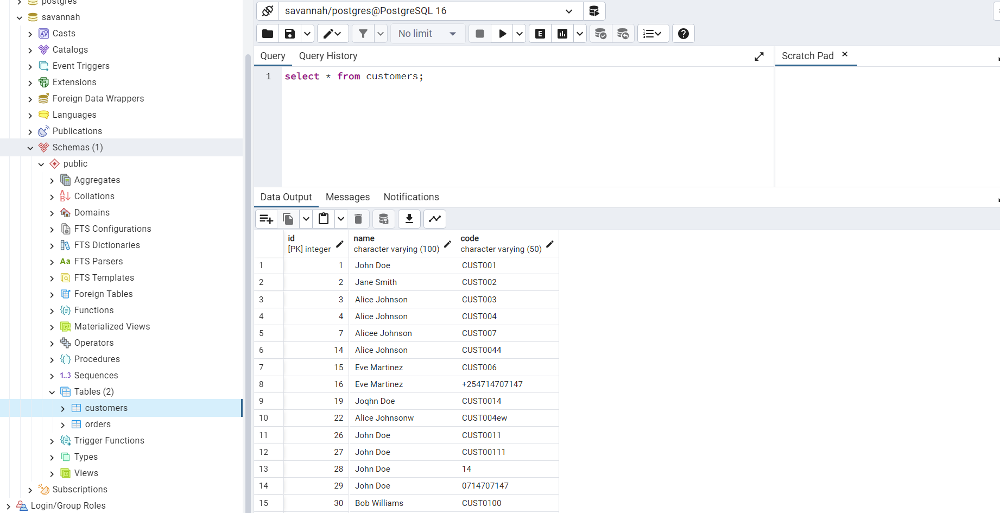
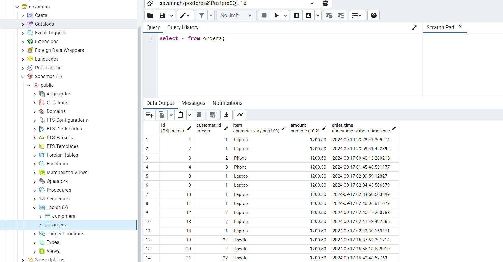
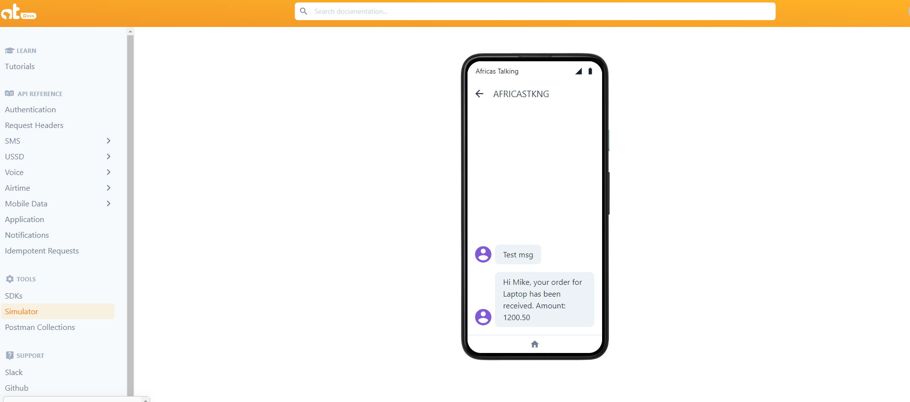
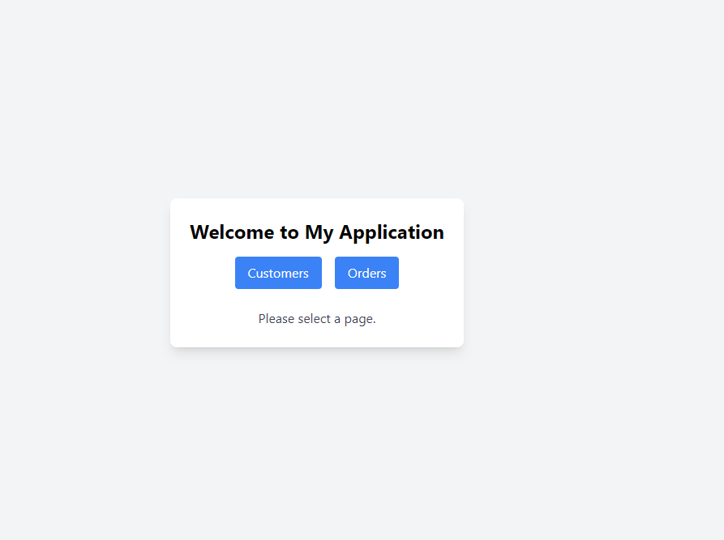
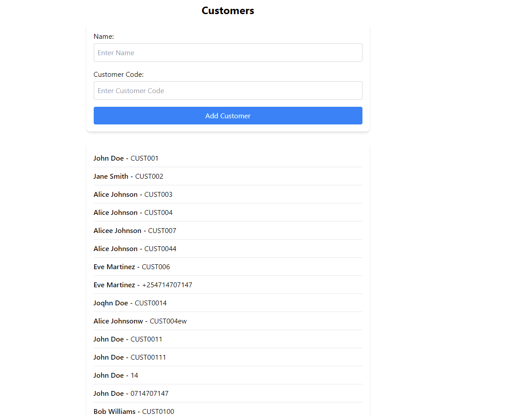
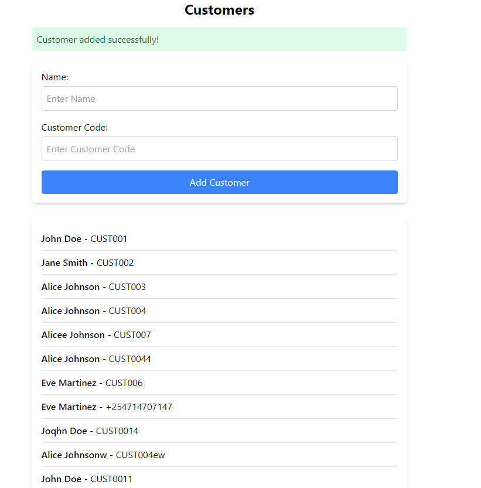
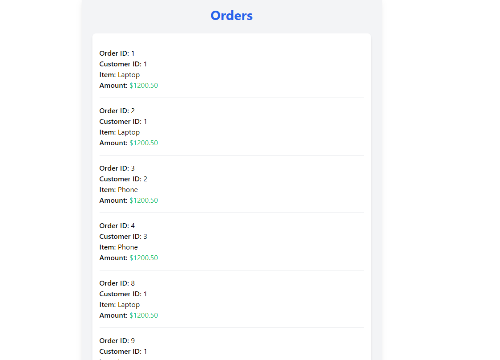
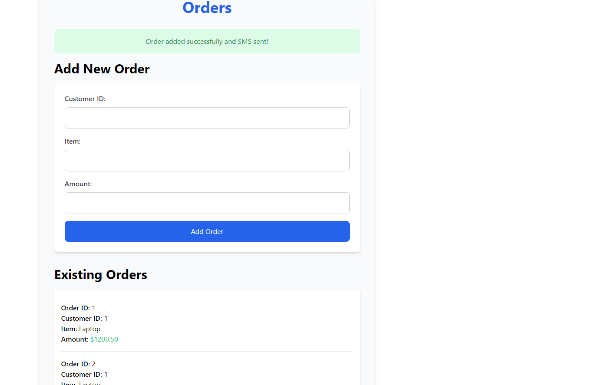
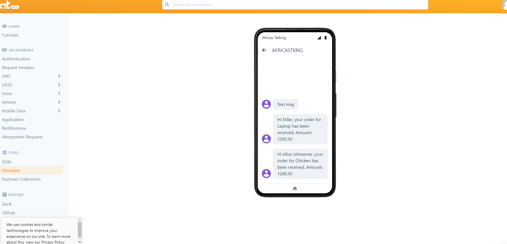

# Savannah_screening_test Technical-Interview

## Features

- Manage customers and orders with a simple API
- Send SMS alerts using Africa's Talking
- Database: Uses PostgreSQL for data storage.

## Getting Started Backend 

1. Clone the repo: `https://github.com/MICHAELKITH/Savannah_screening_test.git `
2. cd Backend
3. Install dependencies: `go mod tidy`
4. Run the app: `go run main.go`

## Getting Started Frontend
1. Clone the repo: `https://github.com/MICHAELKITH/Savannah_screening_test.git `
2. cd frontend
3. Install dependencies: `npm install`
4. Run the app: `npm start`

## Prerequisites
- Golang
- Docker
- Docker Hub account
- PostgreSQL database
- Postman for APIs Testing 
- Africa's Talking API credentials for SMS notifications

1. ### Configure MySQL
Set up a  PostgreSQL database

Created Customers Table

Created Orders Table

Overall Database Schema

1. Configured SMS Notifications
Set up Africa's Talking API credentials and configured my application to use these credentials for sending SMS notifications.

SMS Sent to customer after order creation

## User Journey

Simple Homepage

Add Customer Page

Success Adding a Customer

Add Order Page

Add Order Page

Success Adding a Page

SMS Sent to customer after order creation

## Conclusion
My Customer-Order App is set up with Docker, PostgreSQL, and SMS integration. 

## JSON for customer request
{
	"name": "Bob Williams",
	"code": "CUST005"
}
  

  ## JSON for customer request
  {
	"customer_id": 1,
	"item": "Laptop",
	"amount": 1200.50
  }